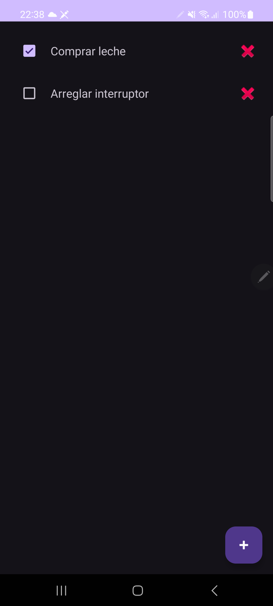
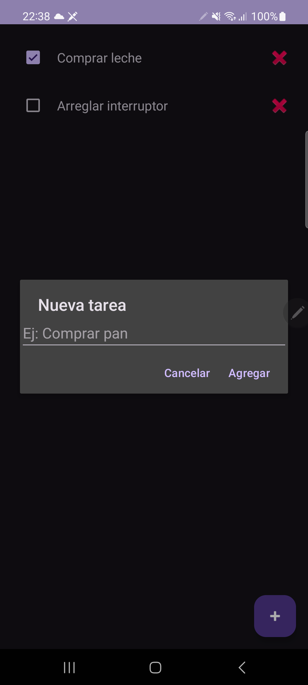
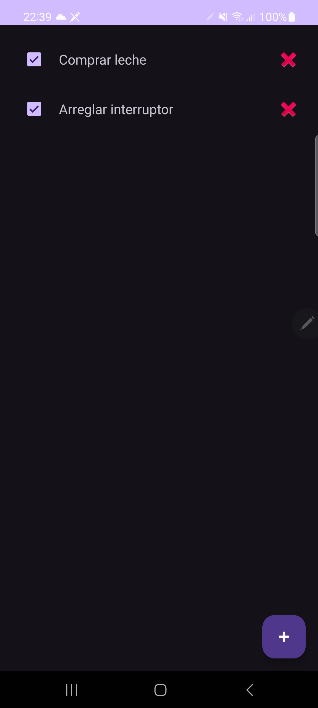

# Lista de Tareas
App Android (Java) para gestionar una lista de tareas: **agregar**, **marcar como completadas** y **eliminar**, con **persistencia local** mediante `SharedPreferences`. Proyecto didáctico para practicar `RecyclerView`, `AlertDialog` y manejo básico de estado.

<p align="center">
  
  
  
</p>

## Funcionalidades
- ➕ Agregar tareas desde un **FloatingActionButton** con `AlertDialog`.
- ☑️ Marcar/Desmarcar tareas como completadas (checkbox por ítem).
- 🗑️ Eliminar tareas individualmente.
- 💾 **Persistencia**: guarda y restaura tareas y su estado con `SharedPreferences`.
- 📜 Lista renderizada con **RecyclerView** + `LinearLayoutManager`.

## Tecnologías y librerías
- **Android Studio** (Java)
- **RecyclerView** (`androidx.recyclerview`)
- **Material Components** (`com.google.android.material:material`)
- **SharedPreferences** (persistencia simple)
- **org.json** (serialización en JSON)

## Requisitos
- Android Studio (versión reciente).
- Min SDK recomendado: **24** o **26**.
- Emulador Android o dispositivo físico con Depuración USB.

## Cómo clonar y ejecutar
1. Clonar el repositorio:
   ```bash
   git clone https://github.com/Mauro0803/ListaDeTareas.git
2. Abrir la carpeta del proyecto en Android Studio.
3. Esperar sincronización de Gradle.
4. Ejecutar en un emulador o en un dispositivo.
Si usas un dispositivo físico, habilita Opciones de desarrollador y Depuración USB.

## Estructura (resumen)
```txt
app/
└── src/
    └── main/
        ├── java/com/example/listadetareas/
        │   ├── MainActivity.java
        │   ├── Task.java
        │   └── TaskAdapter.java
        └── res/
            ├── layout/
            │   ├── activity_main.xml
            │   └── item_tarea.xml
            └── values/
screenshots/
├── pantalla_lista.png
├── dialogo_agregar.png
└── tareas_completadas.png
CHANGELOG.md
README.md
```
## Uso
- Toca + para agregar una nueva tarea.
- Marca el checkbox para indicar que una tarea está completada.
- Presiona el botón 🗑️ de una fila para eliminarla.
- Cierra y abre la app: las tareas y su estado permanecen.

## Roadmap (próximas mejoras)
- Persistencia con SharedPreferences ✅
- Tachado visual del texto cuando la tarea esté completada.
- Ordenar: no completadas arriba, completadas abajo.
- Editar el título de una tarea al tocarla.
- Divider y mejoras de UI.
- (Opcional) Migrar persistencia a Room.
- (Opcional) Tests instrumentados básicos.

## Changelog
Consulta los cambios por versión en CHANGELOG.md

- v0.1.0: UI base (RecyclerView + FAB)
- v0.2.0: Adapter + datos de prueba
- v0.3.0: FAB + diálogo para agregar
- v1.0.0: Checkbox, borrar y persistencia

## Contribuir
Sugerencias y PRs son bienvenidos. Para cambios grandes, abre primero un issue para discutir la propuesta.

## Autor
Mauricio Bolívar A.
🌐 GitHub: Mauro0803
📧 mauricio0803@hotmail.com

## Licencia
Este proyecto puede usarse con fines educativos.
(Opcional) Puedes agregar una licencia como MIT si lo deseas.